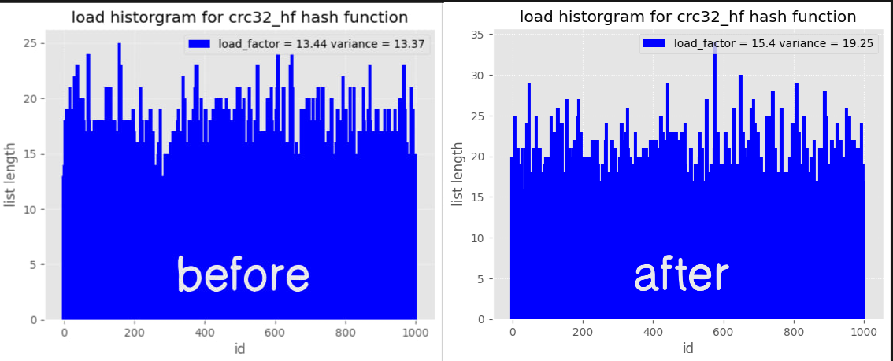

# Анализ и оптимизация хэш-таблицы
---
Хэш-таблица - одна из основных структур данных, используемых в разработке. Ее преимущества - быстрый поиск и вставка.

В этой работе я:
- [x] Написал свой вариант хэш-таблицы
- [x] Проанализировал несколько хэш-функций и выбрал оптимальную
- [x] Выполнил 3 ассемблерные оптимизации, ускорившие работу в $\approx 3$ раза

## Общие сведения по хэш-таблицам

Хэш таблицы хранят пары ключ-значение, доступ к значению производится по ключу путем вычисления хэш функции $h(key)$. Таким образом мы имеем доступ к элементу за О(1). В идеальном мире значение $h(key)$ должно быть уникальным для каждого уникального $key$ и воспроизводимым для одинаковых $key$.
В реальности же, часто бывает так, что возникает **коллизия**: $h(key1) = h(key2), key1 \neq key2$

### Разрешение коллизий

Существует несколько способов разрешения коллизий:

- хэш-таблица с открытой адресацией
- хэш таблица на списках

В моей работе используется вариант с двусвязными списками:

<picture>
  <source media="(prefers-color-scheme: dark)" srcset="img/hash_table_dark.png">
  <source media="(prefers-color-scheme: light)" srcset="img/hash_table_light.png">
  
</picture>

В случае коллизии помещаем значение в список, соответствующий $h(key)$ ячейке хэш-таблицы.
Поиск по списку существенно медленнее, чем по хэш-таблице ($O(n) ~против ~O(1)$).

Видно, что если хэш-функция часто будет возвращать одинаковые значения, часть хэш-таблицы будет пустой, в то время как другая часть будет перегружена длинными списками, что сведет на нет всю выгоду от использования хэш-таблицы.

<picture>
  <source media="(prefers-color-scheme: dark)" srcset="img/good_bad_ht_dark.png">
  <source media="(prefers-color-scheme: light)" srcset="img/good_bad_ht_light.png">
  
</picture>

**Ключевое влияние на эффективность хэш-таблицы оказывает выбранная хэш-функция.**

## Сравнение хэш-функций
Во всех случаях использовался препроцессированный текст за авторством *Martin George RR "Ice and Fire 4 - A Feast for Crows"*, взятый с [github](https://github.com/kaiwang0112006/myebooks/blob/master/content/George_RR_Martin-Ice_and_Fire_books_1-4/).

В препроцессированном файле каждое слово расположено на своей строке в нижнем регистре без знаков препинания для удобства чтения.

Анализ включает в себя построение гистограмм заселенности и тест производительности.

[Перейти к результатам](#return-0)

### Методика измерений
Для построения гистограмм заселенности в хэш-таблицу загружались слова из целевого текста ('target_data'). Для каждого списка сохранялась его длина.

Для анализа производительности в хэш-таблицу загружались слова из целевого текста. Дальше в буфер загружались слова из другого набора ('test_cases'). В файл с результатами сохранялись значения среднего времени поиска $\mu$, стандартного отклонения $\sigma^2$, минимальное время поиска и максимальное время поиска для каждого теста.

По результатам тестирования строилась гистограмма

### Return 0
$h(key) = 0$ при любых входных данных.

Данная хэш функция очевидно плоха, т.к. помещает все значения в один и тот же список. В этом случае мы не видим пользы от хэш-таблицы т.к. эта ситуация эквивалентна созданию одного единственного списка.

<picture>
  <source media="(prefers-color-scheme: dark)" srcset="img/load_hists/retzero_hf_dark_background.png">
  <source media="(prefers-color-scheme: light)" srcset="img/load_hists/retzero_hf_ggplot.png">
  
</picture>

### ASCII первой буквы
$h(key) = ASCII(key[0])$ - ascii код первой буквы слова key

Эта хэш функция лучше предыдущей, т.к. существуют данные для которых она вернет разные значения, но она все равно плохая, потому что:
- распределение букв с которых могут начинаться слова неравномерное (на букву s начинается больше слов чем на z)
- мы можем получить только 26 уникальных значений - число букв в алфавите


<picture>
  <source media="(prefers-color-scheme: dark)" srcset="img/load_hists/ascii_first_hf_dark_background.png">
  <source media="(prefers-color-scheme: light)" srcset="img/load_hists/ascii_first_hf_ggplot.png">
  
</picture>

### Length (key)
$h(key) = length(key)$ - длина слова key

Плохая хэш функция, т.к. длина слова в английском языке редко превышает 10 *(в моем наборе данных максимальная длина слова была 36)* - в этом смысле такая хэш-функция хуже предыдущей.


<picture>
  <source media="(prefers-color-scheme: dark)" srcset="img/load_hists/wd_len_hf_dark_background.png">
  <source media="(prefers-color-scheme: light)" srcset="img/load_hists/wd_len_hf_ggplot.png">
  
</picture>

### CheckSum (контрольная сумма)
$h(key) = sum(key)$ - сумма ASCII кодов букв слова key

Популярная хэш функция из-за своей простоты и относительно хороших показателей дисперсии, но у этой функции есть подводный камень.


<picture>
  <source media="(prefers-color-scheme: dark)" srcset="img/load_hists/ctrl_sum_hf_dark_background.png">
  <source media="(prefers-color-scheme: light)" srcset="img/load_hists/ctrl_sum_hf_ggplot.png">
  
</picture>

Подводный камень:
**давайте увеличим размер хэш-таблицы:**

<picture>
  <source media="(prefers-color-scheme: dark)" srcset="img/load_hists/ctrl_sum_hf_long_dark_background.png">
  <source media="(prefers-color-scheme: light)" srcset="img/load_hists/ctrl_sum_hf_long_ggplot.png">
  
</picture>

Распределение стало очень неравномерным, связано это с тем что сумма ascii кодов любого слова почти никогда не превышает какое-то значение из-за лингвистических ограничений.

### ROR hash function
$h(key) = ???$

### CRC32 - cycle redundancy check
$h(key) = crc32(key)$ - эта функция используется для коррекции ошибок, вызванных шумом, при передаче данных. Внутри себя она считает проверочное значение (check value). Функция, которая его считает часто используется как хэш-функция.

<picture>
  <source media="(prefers-color-scheme: dark)" srcset="img/load_hists/crc32_hf_dark_background.png">
  <source media="(prefers-color-scheme: light)" srcset="img/load_hists/сrc32_hf_ggplot.png">
  
</picture>

Распределение выглядит хорошо: оно равномерно и нет больших незаселенных участков.

*В дальнейшем я буду использовать именно эту хэш-функцию.*

## Измерение производительности

Задача была оптимизировать хэш-таблицу под поиск, поэтому тестировать будем функцию поиска.

Хэш-таблица изначально хранит данные по словам из книги Джорджа Мартина (см. выше), искать слова мы будем не из этого же набора, чтобы встречались ситуации "ненахода" слова в хэш-таблице.

**Данные для заполнения хэш-таблицы:**  слова из книги Джорджа Мартина ([источник](https://github.com/kaiwang0112006/myebooks/blob/master/content/George_RR_Martin-Ice_and_Fire_books_1-4/))

**Данные для тестирования:** список английских слов ([источник](https://github.com/dwyl/english-words/blob/master/words.txt))

Время работы функции замерялось с помощью ассемблерной вставки инструкции 'rdtsc'.

### Профилирование

В качестве профилировщика был выбран perf.

Чаще всего использовались команды:

```
sudo perf record
sudo perf report
```

## Оптимизации

Хоть и изначальной целью работы было ускорение хэш-таблицы с помощью ассемблерных оптимизаций, в реальной практике к ним стоит относиться осторожно и использовать только если они дают значимую выгоду, так как они ухудшают переносимость и читаемость кода.

Поэтому перед выполнением ассемблерных оптимизаций, я выполнил внеассемблерные.

### Отключение *assert* и верификаторов

Самые очевидные внеассемблерные оптимизации - выключить `assert` и верификаторы структур данных, скомпилировать с ключами '-O2', '-O3'

Результаты приведены в таблице:

| Оптимизация                                            | Среднее время работы для $h = crc32$, TSC   | Относительное ускорение среднего времени поиска    |
| :------------------------------------------------------| :-----------------------------------------: | :------------------------------------------------: |
| `-O0`                                                  | 806                                         | 0.46                                               |
| `-O1`                                                  | 806                                         | 1                                                  |
| `-O1` + отключение *assert*                            | 734                                         | 1.10                                               |
| `-O1` + отключение *assert* и верификаторов            | 567                                         | 1.42                                               |
| `-O2` + отключение *assert* и верификаторов (BASELINE) | 547                                         | 1.47                                               |
| `-O3` + отключение *assert* и верификаторов            | 592                                         | 1.36                                               |

**Далее компилировать будем под `-O2` без assert и верификаторов. Выбираем в качестве baseline.**

### Ускорение сравнения строк

#### Обоснование

В случае коллизии слова помещаются в связный список, в результате чего поиск слова в этом списке за `O(n)` - значительно дольше, чем поиск за `O(1)` в идеальной хэш-таблице.

Во время поиска строки из списка сравниваются с ключевой строкой, в результате чего сравнение строк - самая часто-вызываемая функция.

Это подтверждается профилировщиком:

```
sudo perf report --stdio --call-graph=fractal -Mintel --symbol-filter=RunPerformanceTestHashTable --percent-limit=2
```

<blockquote>

```
# Children      Self  Command  Shared Object  Symbol
# ........  ........  .......  .............  ............................................
#
     3.73%     0.00%  exec     exec           [.] RunPerformanceTestHashTable(...)
            |
            ---RunPerformanceTestHashTable(_IO_FILE*, _IO_FILE*, HashTable*, char const*)
               |
               |--98.54%--HashTableGetVal(HashTable*, char const*)
               |          |
               |          |--99.66%--ListKeyGetId(List*, char const*, ListDebugInfo)
               |          |          |
               |          |          |--82.50%--__strcmp_avx2
               |          |          |          |
               |          |          |           --100.00%--asm_common_interrupt
               |          |          |                     common_interrupt
               |          |          |                     __common_interrupt
               |          |          |                     handle_edge_irq
               |          |          |
               |          |           --17.50%--strcmp@plt
               |           --0.34%--[...]
                --1.46%--[...]
```

</blockquote>

Посмотрим отдельно на функцию `ListKeyGetId`:

<blockquote>

```
            for (int i = NEXT(0); i != 0; i = NEXT(i))
│  0,17 │      mov     r13, QWORD PTR [rdi+0x8]
│  0,29 │      mov     r12d,DWORD PTR [r13+0x0]
│  0,02 │      test    r12d,r12d
│       │    ↓ je      60
│       │   if (!strcmp (DATA(i).key, key))
│       │      mov     r14, QWORD PTR [rdi]
│       │      mov     rbp,rsi
│  0,00 │    ↓ jmp     32
│       │      nop
│       │   for (int i = NEXT(0); i != 0; i = NEXT(i))
│  0,08 │28:   mov     r12d,DWORD PTR [r13+rbx*4+0x0]
│  0,09 │      test    r12d,r12d
│  0,25 │    ↓ je      60
│       │   if (!strcmp (DATA(i).key, key))
│ 22,07 │32:   movsxd  rbx,r12d
│  0,08 │      mov     rsi,rbp
│  0,00 │      mov     rax,rbx
│  0,11 │      shl     rax,0x4
│ 55,90 │      mov     rdi,QWORD PTR [r14+rax*1]
│  0,16 │    → call    strcmp@plt
│  0,03 │      test    eax,eax
│ 20,60 │    ↑ jne     28

```

</blockquote>

Часть кода, ответственная за вызов `strcmp` занимает более 50 % от времени выполнения самой горячей части кода *(на самом деле, не совсем от времени, но не будем вдаваться в подробности работы perf профайлера)* $=>$ оптимизируем ее.

#### Оптимизация

|Предложение|Детали реализации|
|-----------|-----------------|
|Во время поиска слова в списке нам достаточно информации равно оно текущему, или нет, то есть если у них не совпадают длины - такие слова гарантированно не равны. Длины слов играют роль хэшей*!|Подавать слово на вход с "приклеенным" к нему слева байтом - его длиной, этот байт приклеивается во время препроцессинга
|Если длины слов равны, их можно сравнивать с помощью SIMD инструкций, чтобы избежать лишних циклов|Если слова влезают в YMM регистры - сравнивать их SIMD инструкциями, если нет - вызывать стандартный `strcmp`

В функции `ListKeyGetId` заменили функцию `strcmp` на `strcmp_optimized`, которую написали на ассемблере.

> ***Note:** как мы выяснили [ранее](#length-key), вычисление длины слова - не очень хорошая хэш-функция, однако для строк длина - полезный параметр, который влезает в 1 байт.

<blockquote>

<code>pseudo strcmp_optimized (linked_list/strcmp_optd.s)</code>

```
strcmp_optimized:       (pseudocode)
    cmp size_1, size_2
    jne .not_equal

    cmp size_1, size_YMM <-+
                           |-- not an actual code!
    cmp size_2, size_YMM <-+
    jb .use_SIMD

    call strcmp
    jmp .func_end

.use_SIMD:
    <using simd instr. to cmp two strings>

    jmp .func_end

.not_equal:
    mov rax, 1

.func_end:
    ret
```

</blockquote>

<blockquote>

<code>linked_list/super_list.cpp > ListKeyGetId</code>

```
for (int i = NEXT(0); i != 0; i = NEXT(i))
    {
        if (!strcmp_optimized (DATA(i).key, key))
                        // strcmp -> strcmp_optimized
        {
            id = i;
            break;
        }
    }
```

*Поменяли компаратор строк.*

</blockquote>

Для ускорения поиска данные были **выровнены по 32** (*оранжевые байты - длина слова*):


#### Результат

| Оптимизация                                            | Среднее время работы для $h = crc32$, TSC   | Ускорение относительно baseline | Ускорение относительно предыдущей оптимизации |
| :------------------------------------------------------| :-----------------------------------------: | :-----------------------------: | :-------------------------------------------: |
| **BASELINE**                                           | 547                                         | 1                               | 1.47                                          |
| Оптимизация `strcmp`                                   | 181                                         | 3.02                            | 3.02                                          |

**В 3 раза!**

### Ускорение вычисления хэша

#### Обоснование

Вычисление хэш-функции встречается в каждой функции хэш-таблицы, включая функции для взаимодействия со списками.

#### Оптимизация

Заменим вызов функции crc32 на ассемблерную вставку, выполняющую те же действия с помощью встроенной инструкции `crc32`.

<blockquote>

<code>hash_table/hash_functions/hash_functions.cpp</code>

```c
hash_t  CalcStrHashCRC32 (ht_key_t key)
{
    volatile hash_t hash = 0;

    asm volatile (
        ".intel_syntax noprefix\n\t"
        "xor rax, rax\n\t"
        "mov rcx, 4\n"
        ".loop:\n\t"
        "crc32 rax, QWORD PTR [rdi]\n\t"
        "add rdi, 8\n\t"
        "dec rcx\n\t"
        "cmp rcx, 0\n\t"
        "jne .loop\n\t"
        "mov %0, rax\n\t"
        ".att_syntax prefix\n\t"
        : "=r" (hash)
        :
        : "rax", "rcx", "rdi"
    );

    return hash;
}

```

</blockquote>

#### Результат

| Оптимизация                                            | Среднее время работы для $h = crc32$, TSC   | Ускорение относительно baseline | Ускорение относительно предыдущей оптимизации |
| :------------------------------------------------------| :-----------------------------------------: | :-----------------------------: | :-------------------------------------------: |
| Оптимизация `strcmp`                                   | 181                                         | 3.02                            | 3.02                                          |
| Оптимизация `crc32` (inline asm)                       | 176                                         | 3.11                            | 1.03                                          |

Удостоверимся, что гистограмма заселенности не поменялась в результате оптимизации:

<picture>
  <source media="(prefers-color-scheme: dark)" srcset="img/load_hists/cmp_optd_dark.png">
  <source media="(prefers-color-scheme: light)" srcset="img/load_hists/cmp_optd_light.png">
  
</picture>

**Один в один!**

### Ускорение вычисления хэша с помощью intrinsic функций

#### Обоснование

Можно сравнить ускорение этого метода и [методаописанного выше](#ускорение-вычисления-хэша).

#### Оптимизация

Заменим вызов функции crc32 на несколько intrinsic функций, которые дают интерфейс для использования инструкции `crc32` не покидая языка C.

<blockquote>

<code>hash_table/hash_functions/hash_functions.cpp</code>

```c
hash_t  CalcStrHashCRC32 (ht_key_t key)
{
    volatile hash_t hash = 0;

    hash = _mm_crc32_u64 (hash, ((int64_t *)key)[0]);
    hash = _mm_crc32_u64 (hash, ((int64_t *)key)[1]);
    hash = _mm_crc32_u64 (hash, ((int64_t *)key)[2]);
    hash = _mm_crc32_u64 (hash, ((int64_t *)key)[3]);

    return hash;
}

```

</blockquote>

#### Результат

| Оптимизация                                            | Среднее время работы для $h = crc32$, TSC   | Ускорение относительно baseline | Ускорение относительно предыдущей оптимизации |
| :------------------------------------------------------| :-----------------------------------------: | :-----------------------------: | :-------------------------------------------: |
| Оптимизация `crc32` (inline asm)                       | 176                                         | 3.11                            | 1.03                                          |
| Оптимизация `crc32` (intrinsics)                       | 170                                         | 3.22                            | 1.04                                          |

Удостоверимся, что гистограмма заселенности не поменялась в результате оптимизации:

<picture>
  <source media="(prefers-color-scheme: dark)" srcset="img/load_hists/cmp_dark.png">
  <source media="(prefers-color-scheme: light)" srcset="img/load_hists/cmp_light.png">
  
</picture>

**Заселенность не поменялась**

#### Сравнение с предыдущей оптимизацией

Мы получили ускорение в 4% относительно метода inline asm.

Обратим внимание, что ускорение по сравнению с оптимизацией `crc32` методом ассемблерной вставки условно, т.к. при измерениях стандартное отклонение (variance) $\sigma ~\approx ~100%$. В таком случае разница в 4% не имеет никакой статистической значимости.

**Обе оптимизации можно считать одинаково эффективными.**

## Обобщенные результаты оптимизаций

**Внеассемблерные**
| Оптимизация                                            | Среднее время работы для $h = crc32$, TSC   | Относительное ускорение среднего времени поиска    |
| :------------------------------------------------------| :-----------------------------------------: | :------------------------------------------------: |
| `-O0`                                                  | 1752                                        | 0.46                                               |
| `-O1`                                                  | 806                                         | 1                                                  |
| `-O1` + отключение *assert*                            | 734                                         | 1.10                                               |
| `-O1` + отключение *assert* и верификаторов            | 567                                         | 1.42                                               |
| `-O2` + отключение *assert* и верификаторов (BASELINE) | 547                                         | 1.47                                               |
| `-O3` + отключение *assert* и верификаторов            | 592                                         | 1.36                                               |

**Ассемблерные**
| Оптимизация                                            | Среднее время работы для $h = crc32$, TSC   | Ускорение относительно baseline | Ускорение относительно предыдущей оптимизации |
| :------------------------------------------------------| :-----------------------------------------: | :-----------------------------: | :-------------------------------------------: |
| **BASELINE**                                           | 547                                         | 1                               | 1.47                                          |
| Оптимизация `strcmp`                                   | 181                                         | 3.02                            | 3.02                                          |
| Оптимизация `crc32` (inline asm)                       | 176                                         | 3.11                            | 1.03                                          |
| Оптимизация `crc32` (intrinsics)                       | 170                                         | 3.22                            | 1.04                                          |

С использованием ассемблерных методов мы добились ускорения в 3.22 раза относительно baseline-версии и в 10.31 раз относительно `-O0` версии!

На ассемблере было написано максимум **n_asm = 49** строк.

Ускорение составило **eps_v = 10.31**

k_opt = eps_v / n_asm * 1000

Критерий оптимизации получился **k_opt = 210.41**, хорошо это или плохо - я узнаю от деда.

> **Вывод:** Использование ассемблера для ускорения кода оказалось эффективным и превзошло мои ожидания, однако *With great power comes great responsibility*. И эта responsibility - в поддержании работоспособности этого кода на платформах, отличных от моего ПК.

## Мой ~~работяга~~ процессор

```
netort@thinkpad-x1:~/hash_table$ lscpu
Architecture:            x86_64
  CPU op-mode(s):        32-bit, 64-bit
  Address sizes:         39 bits physical, 48 bits virtual
  Byte Order:            Little Endian
CPU(s):                  4
  On-line CPU(s) list:   0-3
Vendor ID:               GenuineIntel
  Model name:            Intel(R) Core(TM) i5-5200U CPU @ 2.20GHz
    CPU family:          6
    Model:               61
    Thread(s) per core:  2
    Core(s) per socket:  2
    Socket(s):           1
    Stepping:            4
    CPU max MHz:         2700,0000
    CPU min MHz:         500,0000
    BogoMIPS:            4389.56
    Flags:               fpu vme de pse tsc msr pae mce cx8 apic sep mtrr pge mca cmov pat pse36 clflush dts acpi mmx fxsr sse sse2 ss ht tm pbe syscall nx pdpe1gb rdtscp lm constant_tsc arc
                         h_perfmon pebs bts rep_good nopl xtopology nonstop_tsc cpuid aperfmperf pni pclmulqdq dtes64 monitor ds_cpl vmx est tm2 ssse3 sdbg fma cx16 xtpr pdcm pcid sse4_1 sse
                         4_2 x2apic movbe popcnt tsc_deadline_timer aes xsave avx f16c rdrand lahf_lm abm 3dnowprefetch cpuid_fault epb invpcid_single pti ssbd ibrs ibpb stibp tpr_shadow fle
                         xpriority ept vpid ept_ad fsgsbase tsc_adjust bmi1 avx2 smep bmi2 erms invpcid rdseed adx smap intel_pt xsaveopt dtherm ida arat pln pts vnmi md_clear flush_l1d
Virtualization features:
  Virtualization:        VT-x
Caches (sum of all):
  L1d:                   64 KiB (2 instances)
  L1i:                   64 KiB (2 instances)
  L2:                    512 KiB (2 instances)
  L3:                    3 MiB (1 instance)

    <...>
```

## Источники
**Данные для тестирования и заполнения хэш-таблиц**
- [~~кошачий~~ "наполнитель" для хэш-таблицы](https://github.com/kaiwang0112006/myebooks/blob/master/content/George_RR_Martin-Ice_and_Fire_books_1-4/)
- [часто-используемые в языке слова для тесткейсов](https://www.ef.com/wwen/english-resources/english-vocabulary/top-1000-words/)
- [рандомные слова для тесткейсов](https://gist.github.com/cjhveal/3753018)

**Оптимизации & общая информация**
- [x86 instruction reference](https://www.felixcloutier.com/x86/)
- [СMOV instruction](https://www.felixcloutier.com/x86/cmovcc)
- [ORACLE x86 Assembly Language Reference Manual](https://docs.oracle.com/cd/E36784_01/html/E36859/gntae.html#scrolltoc)

**Книги**
- Randal E. Bryant and David R. O'Hallaron "Computer Systems: A Programmer's Perspective 3rd Edition"
- Fedor G. Pikus "The Art of Writing Efficient Programs"